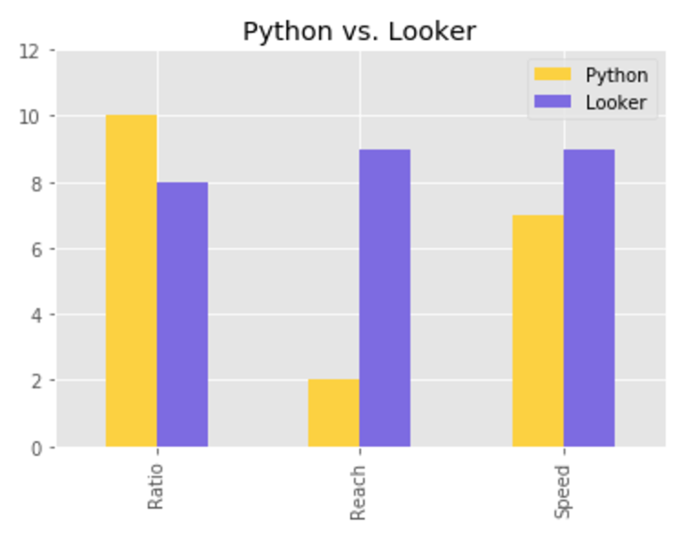
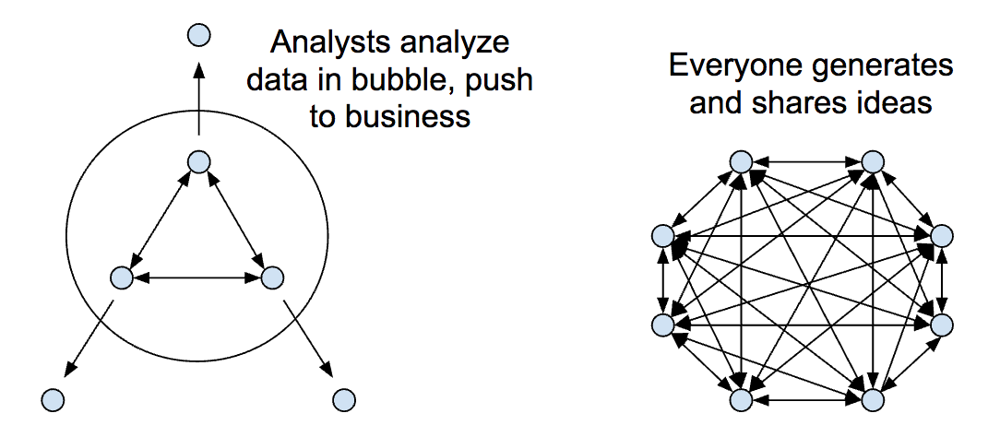

## Defining Ad Hoc Analysis Tools

What is an ad hoc analysis tool? What makes these tools useful for the average user, and what makes these tools truly good?

**An analysis tool qualifies as "ad hoc" if you can answer arbitrary questions**. You’re not limited to seeing fixed charts and dashboards - you can explore data on your own.

Consider the business of Uber. Employees may want to ask questions like:

* How long is the average ride in LA?
* How many rides does the average user take in one month?
* Has the average cost of a ride in San Francisco increased or decreased over the past year?

If you can't answer questions like this - and questions that get more nuanced as your business becomes more complex - you don't have an ad hoc analysis tool.

A database like [MySQL](https://www.mysql.com/) is an ad hoc tool. Given the right data model, you can ask almost any question with SQL.

Tableau fails this test. Tristan Handy of Fishtown Analytics [puts it best](https://blog.fishtownanalytics.com/is-looker-the-right-business-intelligence-tool-for-my-company-afc1f750a0f9):

> If you have a CSV and want to make the best chart in the world, use Tableau. If you want to ask arbitrary questions about the status of or trends in your business, don’t.

Any general purpose programming language, like Python, also qualifies. You can interactively load and query data, slicing and dicing it in any way. Programming environments like [RStudio](https://www.rstudio.com/) and [Jupyter notebooks](http://jupyter.org/) facilitate such analysis for analysts and data scientists.

Tools like [Periscope](https://www.periscopedata.com/) and [Mode Analytics](https://modeanalytics.com/) make ad hoc analysis even easier. You can quickly produce charts and share insights with others, but only if you know SQL.

If you have to write code to ask questions, the business can’t use the tool. For everyone to get the data they need to do their jobs, we need a simpler interface.

If you can ask questions _without_ writing code, you have a _general_ ad hoc analysis tool: one that can be used by the general public. [Excel](https://products.office.com/en-us/excel), [Looker](https://looker.com/), [Superset](http://airbnb.io/superset/) and [Metabase](http://www.metabase.com/) all pass this test.

If the business needs to perform ad hoc analysis, your tool must be general. If only few people analyze data at your company - all of whom know SQL - other tools may be a better fit.

When deciding what kind of tool might work best, you should answer a few more questions:

* _Reach_: Of the people who need access to data, who can use the tool?
* _Ratio_: Of the questions I ask, how many can I answer?
* _Speed_: How quickly does it take to answer the average question?

Let’s take Python as an example: only developers can use it, but they can answer effectively any question. Competent coders can answer questions quickly, but not as quickly as with Excel.

Looker’s reach is broad, and you can answer questions quickly. But you’re limited to questions you can ask with SQL, and you rely on measures and dimensions created for you - you can’t ask _any_ question using Looker’s pivot table.

We can assign rough scores to these criteria - values from 0 to 10 - and compare tools to one another:

Of all these criteria, **reach is the most important**. It's important to provide these tools not only to the analysts that are _expected_ to have them, but also to the account managers, sales people, and product managers who need these tools to do their jobs effectively. When more people can ask questions, they generate and share more ideas. Others iterate on the original ideas to improve them. The broader the reach of your analysis tool, the larger the [network effect](https://en.wikipedia.org/wiki/Network_effect).

Most businesses use many of the tools listed above. To empower the whole business with data, a general ad hoc tool must be one of them.
